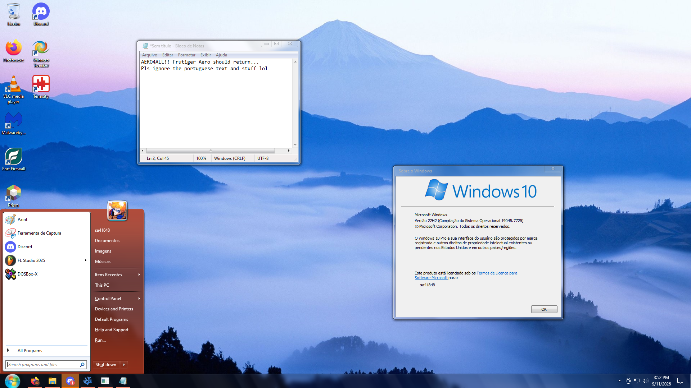

# TRANSFORMING WINDOWS 10 UI INTO WINDOWS 7

## Required Software
You'll need to install these cool open source software:
* [Open-Shell][OPENSHELL]
* [SecureUxTheme][SECUREUXTHEME]
* [DWMBlurGlass][DWMBLURGLASS]

## Step 1: Installing Windows 7 Cursors & Sound Scheme
1. Open the folder **1-win7cursor** and execute **1AUTOYOURLIFE.bat**.
 If you prefer doing everything manually, open **0README.txt** instead!
2. Do the same but with the folder **2-win7newsounds**.

## Step 2: Making windows have the Glass Effect for Title Bars
1. Make sure you installed [**DWMBlurGlass**][DWMBLURGLASS] properly.
2. Execute **DWMBlurGlass.exe** where you installed it.
3. Import the file **coolaero.ini** inside **6-DWMBlurGlass** in the _Config_ page.
 You can customize settings yourself if wanted.

## Step 3: Customizing Open-Shell to look like Windows 7
1. Make sure you installed [**Open-Shell**][OPENSHELL] properly.
2. Open the folder **5-OpenShell** and execute **1AUTOYOURLIFE.bat**.
3. Locate and launch **Open-Shell Menu Settings**.
4. Click on the **Backup** Drop-Down List and click **Load from XML File...**.
5. Open **%USERPROFILE%\Documents\Aero4All\win7.xml** in the _File Dialog_.

## Step 4: Applying the Windows 7 Theme
1. Make sure you installed [**SecureUxTheme**][SECUREUXTHEME] properly.
2. Open the folder **3-win7theme** and execute **1AUTOYOURLIFE.bat**

## Step 5: Installing Custom Branding and Windows 7 Icons
1. Restart Windows in a Command Prompt.
2. In cmd.exe, locate the folder **4-win7icos** and execute **1AUTOYOURLIFE.bat**
3. Reboot and enjoy your cool Windows!

## Conclusion
Well, sorry if this isn't the best or easiest to follow guide... This is my first time writing one!  
But, I hope everything worked for you(if you actually followed it) and don't forget to let me know if certain parts of the system aren't looking as expected!  
I plan to do a revision of specific images and add more modified DLLs but that's it for now, ciao! :D  
Also, checking the **CREDITS.md** file is well appreciated...

[OPENSHELL]: https://github.com/Open-Shell/Open-Shell-Menu
[SECUREUXTHEME]: https://github.com/namazso/SecureUxTheme
[DWMBLURGLASS]: https://github.com/Maplespe/DWMBlurGlass